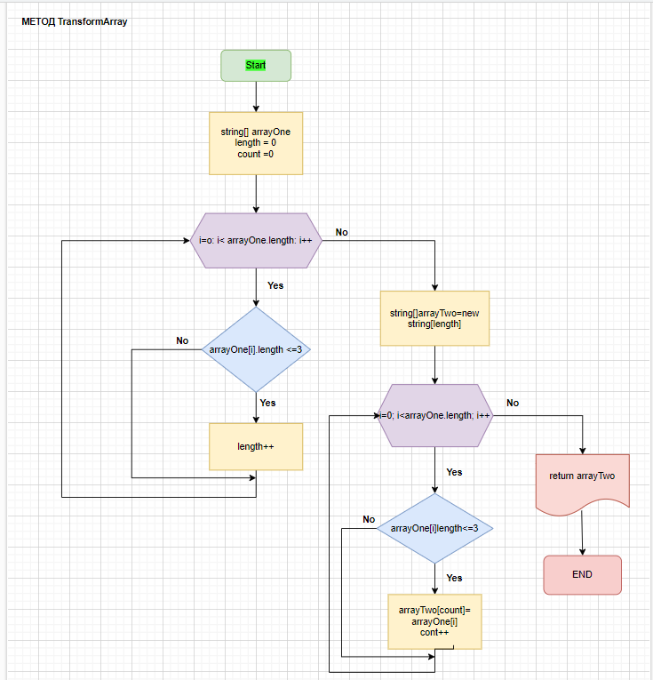

# Описание контрольной работы 
## Задание:

* Создать репозиторий на GitHub.
* Нарисовать блок-схему алгоритма.
* Снабдить репозиторий текстовым описанием (Readme.md) с описанием решения работы.
* Написать программу на C#
* Залить все на GitHub в несколько коммитах.


## Задача: 
Написать программу, которая из имеющегося массива строк
Формирует массив из строк, длинна которых меньше либо равна 3 символа. Первоначальный массив можно вывести с клавиатуры, либо задать на старте выполнение алгоритма. При решении не рекомендуется пользоваться коллекциями, лучше обойтись исключительно массивами.

**Примеры:**

Исходный массив | Новый массив
:---: | :---:
["hello", "2", "world", ":-)"] | ["2", ":-)"]
["1234", "1567", "-2", "computer science"] | ["-2"]
["Russia", "Denmark", "Kazan"] | []


## Описание кода
В коде используются следующие методы:

* InputInt
 - метод, запрашивающий ввод данных с клавиатуры с соответствующим сообщением;
* NewArray - метод, создающий и заполняющий массив данными, введенными пользователем;
* Метод использует вышеупомянутый метод InputInt;
* OutputArray - метод, выводящий содержимое массива в консоль;
* TransformArray - метод, который формирует новый массив из переданного массива строк, с длиной каждой строки *менее либо равной 3 символа*.

#### Блок-схема логики работы метода TransformArray:



#### код метода TransformArray:

```c#
string[] TransformArray(string[] arrayOne)
{
    int length = 0;
    int count = 0;
    for (int i = 0; i < arrayOne.Length; i++)
        if (arrayOne[i].Length <= 3) length++;
    string[] arrayTwo = new string[length];
    for (int i = 0; i < arrayOne.Length; i++)
    {
        if (arrayOne[i].Length <= 3)
        {
            arrayTwo[count] = arrayOne[i];
            count++;
        }
    }
    return arrayTwo;
}


#### код программы на C#:
string InputInt(string message)
{
    Console.Write(message);

    return Console.ReadLine();
}

string[] NewArray()
{
    int length = int.Parse(InputInt("Введите длину массива: "));
    string[] arrayOne = new string[length];

    for (int i = 0; i < arrayOne.Length; i++)

    arrayOne[i] = InputInt($"Введите значение #{i + 1}/{arrayOne.Length}: ");
    
    return arrayOne;
}

void OutputArray(string[] arrayOne)
{
    for (int i = 0; i < arrayOne.Length; i++)

    Console.Write($"{arrayOne[i]}\t");
    Console.WriteLine();
}

string[] TransformArray(string[] arrayOne)
{
    int length = 0;
    int count = 0;

    for (int i = 0; i < arrayOne.Length; i++)
    if (arrayOne[i].Length <= 3) length++;
    
    string[] arrayTwo = new string[length];
    for (int i = 0; i < arrayOne.Length; i++)
    
    {
        if (arrayOne[i].Length <= 3)
        {
            arrayTwo[count] = arrayOne[i];
            count++;
        }
    }
    return arrayTwo;
}


string[] arrayOne = NewArray();
OutputArray(arrayOne);
string[] arrayTwo = TransformArray(arrayOne);
OutputArray(arrayTwo);
